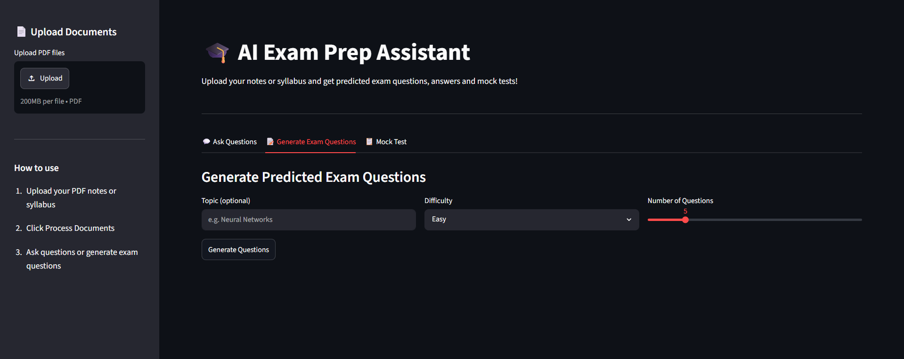
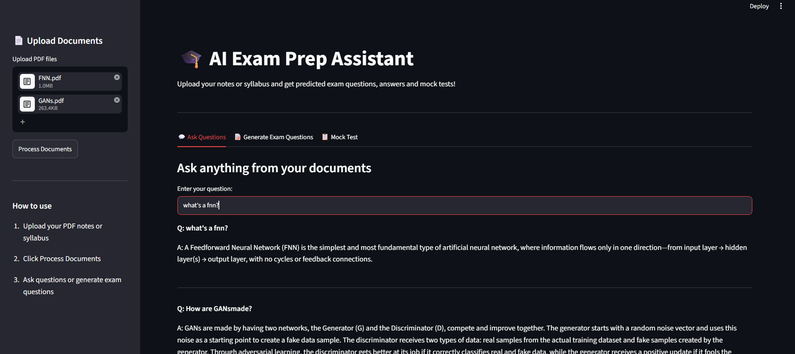
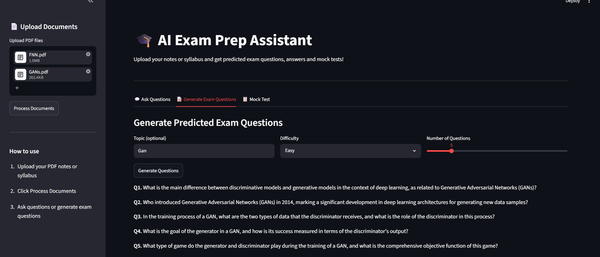
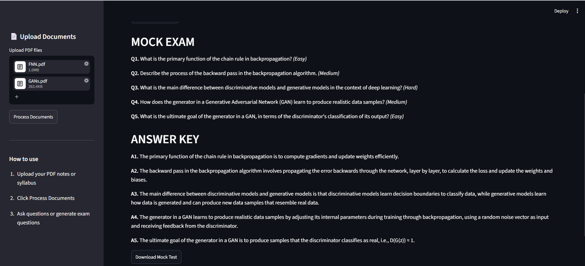

# 🎓 AI Exam Prep Assistant


An AI-powered exam preparation assistant that lets you upload your notes or syllabus as PDF and instantly get predicted exam questions, detailed answers and full mock tests — all generated from YOUR own material using RAG (Retrieval Augmented Generation).

---
## 🚀 Live Demo
👉 [Try it here](https://revisionai.streamlit.app/)

## Screenshots

### Dashboard


### Ask Questions


### Generate Questions


### Mock Test


---


## What It Does

- 📄 **Upload your own PDFs** — notes, syllabus, textbook chapters
- 💬 **Ask questions** and get answers directly from your documents
- 📝 **Generate exam questions** by topic and difficulty level
- 📋 **Create full mock tests** with answer keys
- ⬇️ **Download mock tests** as text files

---

## How It Works

```
Your PDF Notes
      ↓
Split into chunks
      ↓
Convert to vectors (HuggingFace Embeddings)
      ↓
Store in FAISS vector database
      ↓
User asks question or requests exam questions
      ↓
Find most relevant chunks from your notes
      ↓
Send to Groq LLM (Llama 3.3 70B)
      ↓
Get accurate answer from YOUR material
```

---

## Tech Stack

| Tool | Purpose |
|------|---------|
| LangChain | RAG pipeline |
| Groq API | Free LLM (Llama 3.3 70B) |
| FAISS | Vector similarity search |
| HuggingFace Embeddings | Convert text to vectors |
| PyPDF | Read PDF files |
| Streamlit | Web dashboard |

---

## How to Run

**1. Clone the repository**
```bash
git clone https://github.com/shrutinag18/exam-prep-ai.git
cd exam-prep-ai
```

**2. Create virtual environment**
```bash
py -3.12 -m venv venv
.\venv\Scripts\Activate.ps1
pip install -r requirements.txt
```

**3. Get a free Groq API key**
- Go to [console.groq.com](https://console.groq.com)
- Sign up for free
- Create an API key

**4. Create .env file**
```
GROQ_API_KEY=your_api_key_here
```

**5. Run the app**
```bash
streamlit run app.py
```

---

## Features in Detail

### Ask Questions
Upload your notes and ask anything — the AI answers only from your documents, not from general internet knowledge. This means no hallucinations about topics not in your syllabus.

### Generate Exam Questions
Select a topic, difficulty level (Easy/Medium/Hard) and number of questions. The AI generates likely exam questions based on what's actually in your material.

### Mock Test
Generate a full mock test with mixed difficulty questions and a complete answer key. Download it as a text file to study offline.

---

## Why RAG Over Regular Chatbot?

A regular chatbot answers from general training data — it might give you wrong information or topics not in your syllabus. RAG forces the AI to answer only from your uploaded documents, making it accurate and relevant to your specific exam.

---

## Project Structure

```
exam_prep_ai/
├── screenshots/
│   ├── dashboard.png
│   ├── ask-question.png
│   ├── generate-questions.png
│   └── mock-test.png
├── src/
│   ├── document_loader.py    
│   ├── embeddings.py         
│   ├── rag_pipeline.py       
│   └── question_generator.py 
├── app.py                    
├── requirements.txt
├── .env                      
└── README.md
```

---

## Future Improvements

- Support for multiple file formats (Word, PowerPoint)
- Topic wise difficulty analysis
- Spaced repetition flashcard generation
- Performance tracking across mock tests
- Deploy on Streamlit Cloud for public access

---

## What I Learned

- Building end to end RAG pipelines with LangChain
- Vector embeddings and similarity search with FAISS
- Integrating free LLM APIs (Groq)
- Prompt engineering for structured outputs
- Building multi-tab Streamlit applications